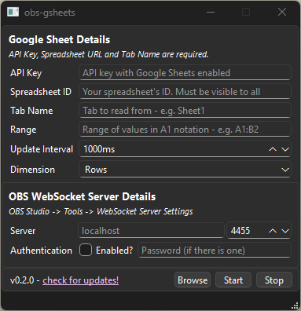

# obs-gsheets

Small GUI application to poll Google Sheets and update matching sources in OBS over WebSocket.

## Releases

You can get [the latest release here](https://github.com/luaugg/obs-gsheets/releases/latest).
I will try my best to maintain backwards compatibility with previous versions where possible.

## Configuration

You can either type in the details or pass in a `config.toml` file, [a sample of which is available here](config.sample.toml).
The only required values are the API key, Spreadsheet ID, and Tab name.

Sources in OBS must have a pipe operator and the cell they read from in their name, e.g. "Team 1 Name | B26".
As of `v0.2.0`, the application will make changes to **images, colour sources, text sources, media sources and browser sources**.

## Contribution

If there is something you would like to add to the project, you can open an issue or a pull request. Please ensure your code is formatted, linted and tested. You can setup your environment by cloning the project and installing [the dependencies listed in the requirements.txt file](requirements.txt). You'll need [the package manager, uv](https://docs.astral.sh/uv/). `uv` can also install the correct Python version for you. If you need to make GUI changes, you can open Qt Widget Designer - it'll be residing in the PySide6 package as `designer.exe` or something similar.

From here, you can either run with the following command:

`uv run python src/main.py`

Or, you can bundle it into a single executable through:

`pyinstaller --onefile --windowed --name=obs-gsheets src/main.py`
